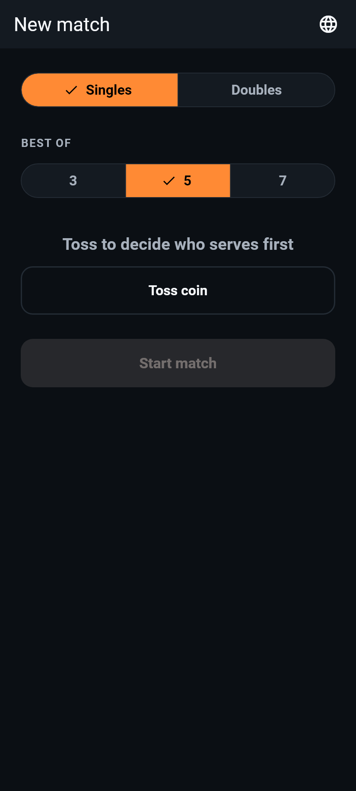
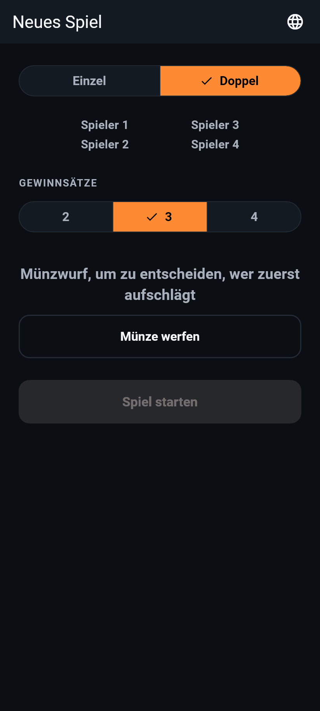
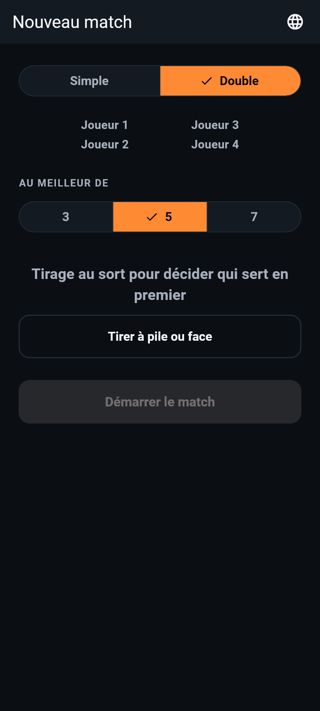
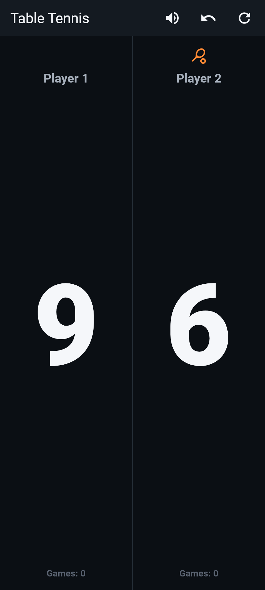
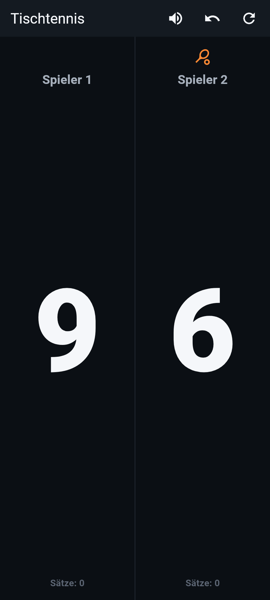
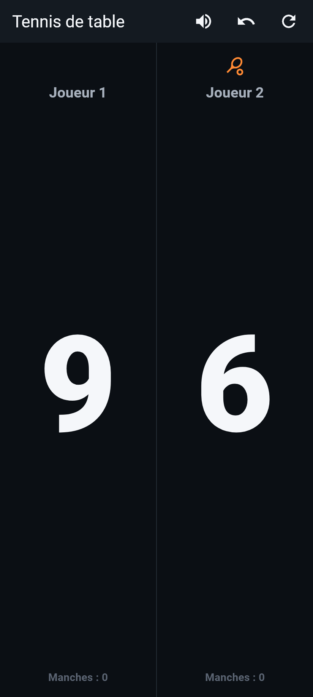
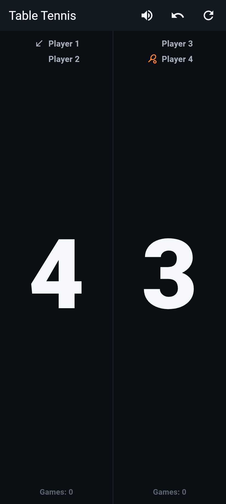
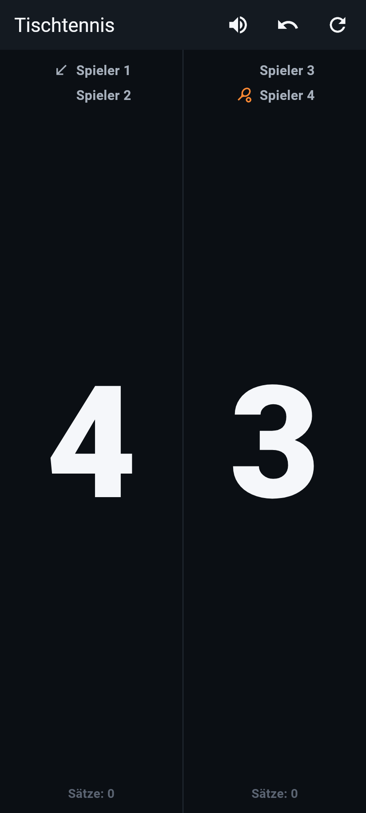

# Phase 4B: UI Polish — Premium Courtside Design

This document records the design plan agreed before implementation, what
was built, a real bug found and fixed along the way (in a disposable
screenshot-capture script, not the app), the before/after screenshots
(English/German/French, setup + scoreboard + doubles), and test results.

**Status:** built and passing (108/108 tests, unchanged count — this was a
visual/layout pass, no new behavior to cover). Visual/layout changes only:
no scoring logic, voice announcement behavior, or localization wording
changed, except the deliberate German best-of heading/segment
restructuring requested in item 1.

---

## 1. Design plan (agreed before implementation)

**Color system.** Dark is the committed *default*, not just a supported
alternative: this app is read at a glance courtside, often in bright or
uneven gym lighting, where a near-black background gives the score the
highest achievable contrast and avoids the washed-out glare a light theme
suffers under strong overhead lighting. Palette: a near-black
blue-tinted background (`#0B0F14`, not pure black — reads as intentional
rather than a plain void, and avoids OLED smearing), one step up for
surfaces (`#141A21`), and a single warm table-tennis-ball-orange accent
(`#FF8A34`) used *only* functionally — serve/receive indicators and
primary buttons — so it never competes with the score for attention. The
score itself uses a separate near-white (`#F5F7FA`) reserved exclusively
for it, deliberately not the accent color, since plain white-on-black is
higher-contrast than any hue-on-black.

**Type scale.** The score digit is the dominant element by a wide margin:
a 176pt base size (wrapped in `FittedBox` so it's always exactly as big as
the available half-screen width allows, never overflowing regardless of
digit count or language), heavy weight (w900), tabular figures so digits
don't shift width between scores. Everything else steps down and mutes in
color to defer to it: player labels (19pt, muted gray, semi-bold),
games-won count (14pt, even more muted), and a small all-caps "eyebrow"
heading style (13pt, letter-spaced) for control labels like "Best of" —
a common pattern for labeling a selector without competing with it.

**Spacing/layout.** Each side of the scoreboard keeps the full-half
tap-anywhere zone from Phase 1, now visibly reinforced with ripple/press
feedback (previously invisible). Within each half, vertical hierarchy is
explicit: small serve/receive icon → muted player name → the score,
vertically centered and dominant → muted games count — nothing competes
with the number in the middle. Icon buttons (mute/undo/reset) and primary
buttons are sized to at least 56×56 for forgiving courtside taps, not
Material's bare 48×48 minimum.

**Motion.** One deliberate moment, not decoration everywhere: the score
digit does a brief scale-in "pop" (220ms, ease-out-back) whenever it
changes — immediate tactile confirmation that a point registered. Game/
match-complete banners and dialogs keep Material's existing built-in
entrance animations rather than getting new custom ones, per "one
well-done moment beats scattered effects."

## 2. What was built

- **`lib/theme/app_theme.dart`** (new): the color system (`AppColors`),
  type scale (`AppTypography`), touch-target constants (`AppMetrics`), and
  `buildAppTheme()` producing a single dark `ThemeData` used as both
  `theme` and `darkTheme` with `themeMode: ThemeMode.dark` forced in
  `main.dart` — dark is the app's one committed look, not conditional on
  system setting.
- **`lib/widgets/animated_score_text.dart`** (new): the shared score-pop
  animation, used identically by both `ScoreboardScreen` and
  `DoublesScoreboardScreen`.
- **`lib/screens/scoreboard_screen.dart`** / **`doubles_scoreboard_screen.dart`**:
  restyled per the plan above — `Material`+`InkWell` (ripple + a visible
  accent-tinted highlight) replacing the old invisible `GestureDetector`,
  `AnimatedScoreText` for the score, muted typography for labels, larger
  `iconSize` on the app-bar buttons.
- **`lib/screens/setup_screen.dart`**: the eyebrow heading style for
  "Best of"/"Gewinnsätze"/"Au meilleur de", plus the best-of
  restructuring below.

## 3. Item 1: the German best-of overflow — root cause and fix

**Root cause**, exactly as diagnosed in the request: English/French follow
one structural pattern — a bare number per segment ("3"/"5"/"7"), with the
explanatory word appearing once, in a heading above ("Best of"/"Au
meilleur de"). Phase 3 broke this pattern for German only, moving the
explanatory word ("Gewinnsätze") *into* each segment ("2 Gewinnsätze," "3
Gewinnsätze," "4 Gewinnsätze") while leaving a separate generic heading
("Spielformat") above — roughly tripling the text each German segment had
to fit compared to English/French, which is exactly why only German
overflowed.

**Fix**: restored the same structural pattern across all three languages.
- `lib/l10n/app_de.arb`: `bestOfLabel` changed from "Spielformat" to
  "Gewinnsätze" (the heading now carries the explanatory word, matching
  "Best of"/"Au meilleur de"'s role exactly); `bestOfSegmentLabel` changed
  from `"{gamesToWin} Gewinnsätze"` to bare `"{gamesToWin}"`.
- English/French `bestOfSegmentLabel` (`"{bestOf}"`) — unchanged.
- `lib/screens/setup_screen.dart` — the segment-building code itself
  didn't need to change at all (it already called
  `l10n.bestOfSegmentLabel(bestOf, gamesToWin)`); only the ARB templates
  needed to change. The heading is now rendered in the shared "eyebrow"
  style for all three languages.

German now shows "GEWINNSÄTZE" as the heading and bare "2"/"3"/"4" as
segments — structurally identical to English's "BEST OF" + "3"/"5"/"7"
and French's "AU MEILLEUR DE" + "3"/"5"/"7". Screenshots in §5 confirm no
overflow in any of the three languages.

**Other strings checked for the same class of issue**: reviewed the
longest string in each language for every UI element (app bar titles,
toss prompt, buttons, mode toggle, snackbar/dialog text, player labels).
None of the others assume equal length across languages — buttons and
headings size to their content or stretch to full width, and the two
genuinely long strings (the toss prompt in German/French, and the
game-complete snackbar) wrap onto a second line by default rather than
clipping, which is visible and unclipped in the screenshots below. The
best-of segment was the only place a *fixed-feeling* segment slot made a
length assumption, and that's now fixed.

## 4. Bug found (in the screenshot tooling, not the app)

While writing the disposable script used to generate §5's screenshots, a
loop iterated across three locales pumping a fresh `MaterialApp` >
`ScoreboardScreen` each time — but without a distinguishing `Key`,
Flutter's widget reconciliation treated each iteration as an *update* to
the same element rather than a new one, reusing the previous iteration's
`State` (and therefore its scoring engine). Scores silently accumulated
across languages instead of resetting (e.g. German's screenshot showed
7-6 instead of the intended 9-6, carrying over a game-complete snackbar
from a game that had actually finished mid-loop). Fixed by giving each
iteration's screen a `ValueKey` derived from the locale, forcing a fresh
mount. This was caught by inspecting the actual screenshots — the German
one showed an unexpected "Spieler 1 gewinnt den Satz" snackbar that had
no business appearing in a 9-6 in-progress screenshot — not by any
automated check, since it's test-tooling code with no test of its own.
Not a bug in the shipped app.

A second, expected issue while building the same tooling: `flutter test`'s
binding has no real fonts available by default (text renders as solid
placeholder boxes), and separately, some Material widgets (buttons,
`SegmentedButton`) resolve their label text style through a path that
doesn't inherit `ThemeData`'s ambient font family the way a plain `Text`
does. Fixed properly in the shipped theme (not just the screenshot
script) by making every `TextStyle` in `app_theme.dart` explicitly say
`fontFamily: 'Roboto'` rather than relying on inheritance — a small
robustness improvement to the real app, not only a tooling workaround.

## 5. Screenshots

All captured at a 412×915 (common phone) surface size, dark theme, real
fonts. Mid-match scores are intentionally shown (not 0-0) so the score's
visual dominance is actually visible.

### Setup screen

**English (singles):**


**German (doubles mode selected — shows the fixed Gewinnsätze heading +
bare-number segments, and the 4-player preview):**


**French (singles):**


### Scoreboard screen (singles)

**English:**


**German:**


**French:**


### Scoreboard screen (doubles)

**English:**


**German:**


(Doubles captured in English and German — French's doubles layout is
structurally identical to German's, shown to confirm the 4-name compact
layout doesn't clip; adding a third would be redundant.)

## 6. Motion (not visible in static screenshots)

The score-pop animation (`lib/widgets/animated_score_text.dart`) can't be
shown in a still image; described here instead. On every score change,
the digit briefly scales in from 1.25× to 1.0× over 220ms with an
ease-out-back curve (a small overshoot-then-settle, giving a tactile
"landed" feel) — implemented with `TweenAnimationBuilder` rather than
`AnimatedSwitcher` specifically because `AnimatedSwitcher` keeps the
outgoing and incoming child mounted simultaneously for the crossfade,
which would have meant two `Text` widgets carrying the same widget-test
key existing at once mid-transition. This was actually caught during
implementation: after first building it with `AnimatedSwitcher`, running
the full test suite produced `Bad state: too many elements` from
`find.byKey` in half a dozen existing widget tests that scored a point
and then immediately checked the score text — a `tester.pump()` mid-test
was catching the app in exactly that transient double-mounted state.
Switching to `TweenAnimationBuilder` (which only ever mounts one instance
of the scored text) fixed it without weakening the animation.

## 7. Test results

```
flutter analyze → No issues found!
flutter test    → 00:06 +108: All tests passed!
```

108/108, same count as before this pass (no new test coverage was
needed — this phase changed visuals/layout, not behavior — except the
German best-of restructuring, which reused the exact tests already
covering that behavior from the Gewinnsätze fix, now updated to expect
the corrected structure: heading "GEWINNSÄTZE" instead of segments
carrying the word, matching the same pattern already verified for
English/French).

## 8. Anything to flag for review

- The uppercase "eyebrow" heading style (`Text(...).toUpperCase()`) is a
  *display* transform, not a wording change — the underlying translated
  string is unchanged in all three languages, only how it's cased on
  screen. Flagging since it's the one place this pass touches how a
  string is *presented* beyond pure layout, per your "no wording changes"
  instruction (the words themselves aren't changed, just capitalized).
- Committing to `fontFamily: 'Roboto'` explicitly (§4) is a small,
  low-risk real behavior change: Material's default typography is already
  Roboto-based in practice, so this mostly just makes that explicit and
  guarantees testable/consistent rendering rather than changing how the
  app looks on a real device.
