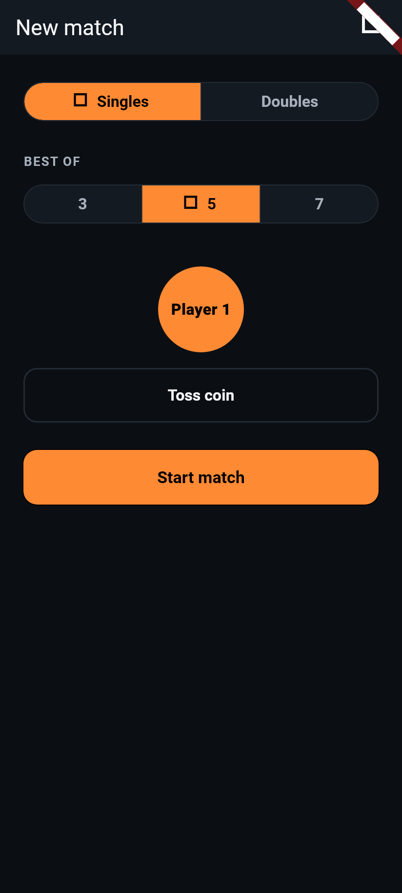
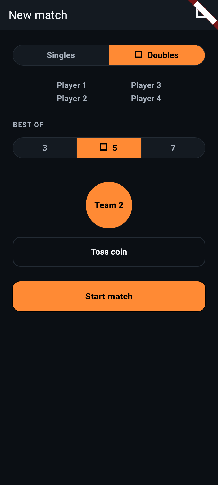

# Phase 4C: Coin-Flip Animation & Doubles Team-Label Wording

Two related UI/UX fixes from user testing and competitor research: a brief
coin-flip flourish before the toss result is revealed, and a wording split
so doubles' toss result and win banners say "Team 1"/"Team 2" instead of
the ambiguous "Player 1"/"Player 2" (which reads as one specific person
when 4 players are on screen). No player-name customization in this pass
— deliberately deferred to a later phase.

**Status:** built and passing (122/122 tests). Updated twice after
shipping: a French terminology correction (§7), and a coin-face content
enhancement — the result now reads directly off the coin itself rather
than as separate text (§8).

---

## 1. Coin-flip animation

**`lib/widgets/coin_flip_indicator.dart`** (new): a 700ms flourish shown
in place of the toss result while it's "settling." Three full rotations
around the vertical axis (`Matrix4.rotateY`) with a shallow perspective
entry (`setEntry(3, 2, 0.0018)`) so the spin reads as a 3D coin tumbling
rather than a flat spin, plus a small scale "hop" (1.0 → 1.18 → 1.0,
peaking at the midpoint) suggesting the coin lifting and landing. Curve is
`Curves.easeOutCubic` so it settles with a gentle deceleration rather than
stopping abruptly. Under a second total, as requested — the one polished
flourish, not a delay. (Originally a plain disc with the result shown as
separate text after landing; changed so the result reads directly off the
coin's own face — see §8.)

**Why `TweenAnimationBuilder`, not `AnimatedSwitcher` (repeating the
Phase 4B lesson deliberately, per your instruction):** Phase 4B's
score-pop animation was originally built with `AnimatedSwitcher` and hit
`Bad state: too many elements` in widget tests, because `AnimatedSwitcher`
keeps the outgoing and incoming child mounted simultaneously during its
crossfade — two widgets carrying the same test `Key` at once. The fix
there was a single `TweenAnimationBuilder` mount per state change instead.
`CoinFlipIndicator` follows that exact pattern from the start: one
`TweenAnimationBuilder`, keyed by the caller (`ValueKey(_tossSequence)` in
`SetupScreen`) so a repeated toss gets a fresh mount rather than updating
in place, and `onEnd` (confirmed present on `TweenAnimationBuilder` in
this Flutter SDK) fires the completion callback once — no manual `Timer`.

**`lib/screens/setup_screen.dart`**: the toss result is now a small state
machine. `_tossCoin()` decides the winner immediately into `_pendingResult`
(so the actual outcome is determined at tap time, not animation-dependent),
and `_pendingResult != null` is what makes the `CoinFlipIndicator` appear
in place of the `tossPrompt` text. `_firstServer` (which gates "Start
match") is set separately, only once `_onCoinFlipComplete()` —
`CoinFlipIndicator`'s `onEnd` — fires, so the button stays disabled for the
full 700ms even though the winner was already decided at tap time. See §8
for how the coin itself now displays that winner as it lands.

**Layout note caught before it became a bug**: the toss-result slot is
deliberately *not* height-constrained. `tossPrompt` wraps to two lines in
German and French (confirmed in Phase 4B's screenshots), so an early draft
that wrapped the coin and text in a fixed-height `SizedBox` would have
clipped the prompt in those languages. Removed the fixed height; the coin
sits in a `Padding` on its own instead.

## 2. Doubles team-label wording

**New ARB strings** (`team1Label`/`team2Label`) in `app_en.arb`
("Team 1"/"Team 2"), `app_de.arb` ("Team 1"/"Team 2" — see §4), and
`app_fr.arb` ("Paire 1"/"Paire 2" — corrected from an initial "Équipe
1"/"Équipe 2," see §7), added after `player4Label` and matching its
naming pattern. Regenerated via `flutter gen-l10n`.

**`lib/screens/setup_screen.dart`**: `_sideLabel(l10n, player)` picks
`team1Label`/`team2Label` when `_isDoubles` is true, otherwise
`player1Label`/`player2Label` — used for both of `CoinFlipIndicator`'s
face labels (§8). The doubles player-slot preview under the mode toggle
still shows the four individual `player1Label`–`player4Label` names,
unchanged.

**`lib/screens/doubles_scoreboard_screen.dart`**: `_teamLabel(team)`
resolves the same two strings, used by both `_showGameCompleteBanner` and
`_showMatchCompleteDialog` in place of the old `player1Label`/
`player2Label`. The 4-player on-court display (`_DoublesTeamZone`,
`_DoublesPlayerRow`) and their serve/receive icons are untouched — they
already correctly identify which of the 4 individuals is serving or
receiving, and continue to show "Player 1"–"Player 4."

**Deliberate wording split, voice vs. banner**: `CommentaryStrings` (voice
announcements) is untouched per Phase 4/4B scope and still says "Player 1"/
"Player 2" for doubles, via the same singles-shaped commentary templates.
So for the same event, the spoken announcement and the on-screen banner
now use different wording for the winning side. This is called out
explicitly (also as a doc comment on `DoublesScoreboardScreen`) because
it's an intentional, scoped decision — redesigning doubles voice wording
was out of scope for this pass, exactly as it was for Phase 4 and 4B.

## 3. Tests added

`test/toss_and_team_labels_test.dart` (14 tests total after §8's
coin-face rework — see that section for the 3 tests added then):

- **Coin-flip timing** (4 tests): "Start match" stays disabled one frame
  after tapping toss, then becomes available after `pumpAndSettle`; the
  flip settles well under 1 second (advancing the clock ~950ms is
  enough); repeated partial pumps through the flip never throw and always
  find exactly one coin face mounted (guards against the
  `AnimatedSwitcher`-style double-mount failure mode from Phase 4B);
  tossing a second time after a result restarts the flip cleanly.
- **Team-label wording, read off the coin** (7 tests): doubles toss shows
  "Team 1" or "Team 2" on the coin; singles toss is unchanged ("Player 1"/
  "Player 2"); switching mode after tossing relabels the same
  already-decided side; the doubles game-complete snackbar (a separate,
  unaffected code path) still says "Team 1"/"Team 2" (the match-complete
  dialog case is covered in `doubles_widget_test.dart` — see below); the 4
  individual on-court labels stay "Player 1"–"Player 4" in doubles;
  German and French doubles tosses show "Team 1"/"Team 2" and "Paire 1"/
  "Paire 2" respectively (the French assertion was updated along with the
  string itself — see §7).

**Existing tests fixed** (timing, not behavior, except one):
`test/widget_test.dart`, `test/doubles_widget_test.dart`, and
`test/localization_widget_test.dart` all had a `tester.pump()` immediately
after tapping `tossButton`, then checked `startMatchButton.onPressed` or
tapped it — valid before this phase, when the toss result was set
synchronously. Changed each to `tester.pumpAndSettle()` so the flip
animation completes first. Separately, `doubles_widget_test.dart`'s
match-complete-dialog test asserted `'Player 1 wins the match!'`, which is
an expected consequence of §2's wording change, not a timing issue —
updated to `'Team 1 wins the match!'`.

## 4. Terminology flagged for review

- German `team1Label`/`team2Label` use the English loanword "Team" rather
  than a native German word, matching the same judgment call already made
  for "Best of" earlier in the project. Should be confirmed against native
  German table-tennis usage. (Still open — no change in this pass.)
- ~~French uses "Équipe 1"/"Équipe 2"...~~ — resolved via research; see §7.

## 5. Test results

```
flutter analyze → No issues found!
flutter test    → 00:16 +122: All tests passed!
```

122/122 (108 original Phase 4C baseline + 14 in
`toss_and_team_labels_test.dart` after §8's rework). No regressions.
(First re-run after the §7 correction was 119/119; this is the final
count after §8 added 3 more tests.)

## 6. Scope confirmation

No player-name customization was added — both features use the existing
numbered Player/Team labels only, per your instruction to defer name
customization to a later phase. No scoring logic, doubles rotation logic,
or existing localization wording (beyond the two new `team1Label`/
`team2Label` strings) changed.

## 7. Correction: French "Équipe" → "Paire"

Found via further research after this phase shipped: "Équipe" is not the
right French word for a doubles pairing — it specifically denotes a club
*team* (3+ players in league team competition), a distinct concept from
the two-player pairing that plays a doubles match. Authoritative French
table-tennis sources (FFTT-based glossaries) consistently use "paire" for
the doubles pairing itself, e.g. "Match : rencontre entre deux joueurs
(simple) ou deux paires (double)."

**Fix**: `app_fr.arb`'s `team1Label`/`team2Label` changed from "Équipe
1"/"Équipe 2" to "Paire 1"/"Paire 2"; regenerated via `flutter gen-l10n`.
Updated the corresponding assertion in
`test/toss_and_team_labels_test.dart` ("French doubles toss result says
'Paire 1'/'Paire 2'"). German's "Team 1"/"Team 2" is unaffected — verified
separately as correct, since German table-tennis sources do use "Team"
naturally for a doubles pair, unlike French. `flutter analyze` and
`flutter test` re-run clean (119/119) after the fix.

## 8. Enhancement: the result now reads directly off the coin

Second post-ship change, from user testing/competitor research: instead
of the coin disappearing at the end of its flip and being replaced by a
separate line of text below it ("Player 1"/"Team 1", via the
`firstServerLabel` string and a `Text` keyed `firstServerLabel`), the
coin's own face now shows the winning label, and stays on screen showing
it — there's no longer a second, separate result text at all.

**How it works — `lib/widgets/coin_flip_indicator.dart`**: `CoinFlipIndicator`
now takes `player1Label`, `player2Label`, and `winner` instead of just
`onComplete`. The coin has two fixed faces: `player1Label` is always
"heads," `player2Label` is always "tails." What determines which face the
coin comes to rest on is no longer just "3 full rotations" unconditionally
— it's `winner == Player.one ? 3.0 : 3.5` turns. An integer number of full
turns always ends facing the camera the same way it started (heads), so
`winner: Player.one` lands heads-up; one extra half-turn flips which face
is forward at the end, so `winner: Player.two` lands tails-up. The overall
motion (duration, curve, perspective, the scale "hop") is completely
unchanged — only the total rotation differs by half a turn, which is not
perceptible as a difference in "feel," and the mechanism for picking
*which* face is visible at any moment (`cos(angle) >= 0`) is the same
before and after landing, so the reveal isn't a separate step bolted onto
the end of the animation — the coin has been "telling the truth" about
where it'll land for the whole spin, the same way a real coin does.

Exactly one face (`_CoinFace`, a small private widget) is ever built at a
time — chosen by a hard cutover at the rotation's midpoint, like a real
coin's edge-on moment, never a cross-fade — so this still follows the
Phase 4B/4C "one clean mount" rule: there's never a moment with both
`Text(player1Label)` and `Text(player2Label)` mounted together under the
same key. The face shown "through the back" of the rotation is
horizontally pre-mirrored (`Matrix4.identity()..scaleByDouble(-1, 1, 1,
1)`) so its text reads correctly once rotated into view, rather than
backwards.

**Sizing**: the coin grew from a plain 40px disc to an 88px circle with
`FittedBox`-scaled text inside (`Text` capped at 2 lines, so even a longer
localized label like German's compound words has room to wrap rather than
overflow) — a plain disc could be small and still read as "a coin," but a
disc carrying a 1-2 word label needs real room to stay legible at a
glance, per your note to enlarge it if needed.

**`lib/screens/setup_screen.dart`**: simplified as a result. The
`_isFlipping` field is gone entirely — `_pendingResult != null` is now the
only condition deciding whether the `tossPrompt` text or the
`CoinFlipIndicator` is shown, since the coin no longer needs to be swapped
out for something else once it lands; it just stays there, landed, as the
permanent record of the result until the next toss. `_firstServer` (which
still separately gates "Start match") is still set only once
`_onCoinFlipComplete` fires, so the button stays disabled for the full
flip exactly as before. The `firstServerLabel` ARB string
("First server: {player}") is no longer used anywhere in the app — left
defined in the ARB files rather than removed, since deleting localized
strings outright wasn't asked for and it's harmless to leave unused.

**Tests**: `test/toss_and_team_labels_test.dart` gained a new "coin face
content" group with 3 deterministic tests that construct
`CoinFlipIndicator` directly (bypassing the setup screen's random
`Random().nextBool()` toss) — `winner: Player.one` settles showing
`player1Label` exactly, `winner: Player.two` settles showing
`player2Label` exactly, and a doubles-labeled instance shows "Team 2" when
`winner: Player.two` — which directly exercises the heads/tails-by-turn-
count logic rather than relying on chance. The existing timing and
team-label tests were updated to read the result off `Key('coinFaceLabel')`
(the `Text` inside `_CoinFace`) instead of the now-removed
`Key('firstServerLabel')`.

**Screenshots** (English, 412×915-equivalent surface at 2x, real fonts):

**Singles, landed on Player 1:**


**Doubles, landed on Team 2:**


Captured with a disposable script (same pattern as Phase 4B's screenshot
tooling: real Roboto fonts loaded via `FontLoader` since `flutter_test`'s
binding has none by default, `RenderRepaintBoundary.toImage()` run inside
`tester.runAsync`), not committed — consistent with how Phase 4B's
screenshot script was handled.

`flutter analyze` and `flutter test` re-run clean (122/122) after this
change.
