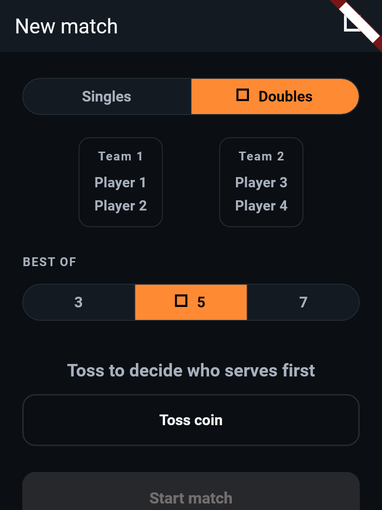
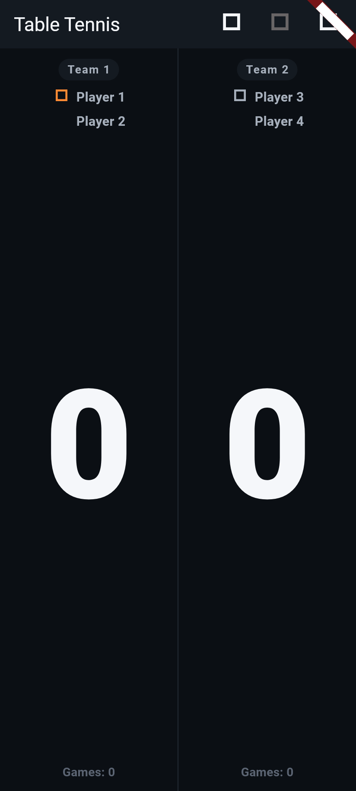
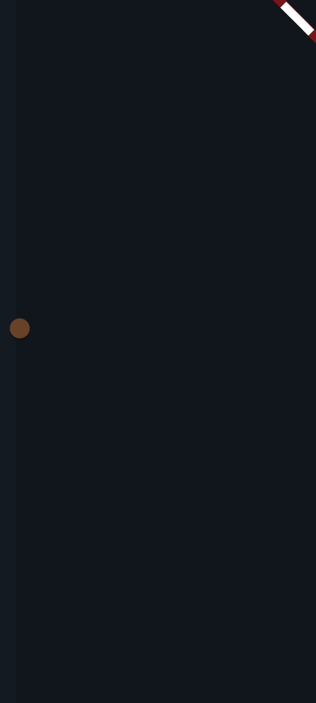

# Phase 4D: Doubles Voice Bug Fix, Team Clarity, and Match-Start Transition

Three changes: a real bug fix (doubles voice announcements disagreed with
the on-screen banner about a game/match winner's name), a UI clarity
improvement (making it obvious at a glance which two players form a team
in doubles), and a new premium touch (a brief ball-flyby transition
between the setup screen and the scoreboard).

**Status:** built and passing (142/142 tests — 122 pre-existing + 20 new).

---

## 1. Bug fix: doubles voice said "Player 1," the banner said "Team 1"

**The bug**: since PHASE4C_TOSS_AND_TEAM_LABELS.md, the on-screen game/
match-complete banner in doubles has correctly said "Team 1"/"Team 2".
But `announcementForPoint` (`lib/services/match_commentary.dart`) always
used `strings.playerLabel` for the winner name in `gameWon`/`matchWon`,
with no way to know it was being called for a doubles match — so voice
still said "Player 1"/"Player 2" (or "Spieler 1"/"Joueur 1") for the same
event the banner called "Team 1"/"Team 2". Two different names for the
same winner, spoken and shown at the same moment, is confusing exactly
the way the original "Player 1" ambiguity was.

**Fix**:
- `lib/services/commentary_strings.dart`: added `teamLabel` alongside the
  existing `playerLabel` — a second `Player Function(Player)` per
  language, matching `team1Label`/`team2Label` from the ARB files
  exactly: English/German "Team 1"/"Team 2", French "Paire 1"/"Paire 2"
  (the corrected wording from PHASE4C_TOSS_AND_TEAM_LABELS.md §7 — not
  "Équipe," which means a club team, not a doubles pairing).
- `lib/services/match_commentary.dart`: `announcementForPoint` gained an
  `isDoubles` parameter (default `false`, so every existing call site is
  unaffected). It now does `final sideLabel = isDoubles ?
  strings.teamLabel : strings.playerLabel;` and uses `sideLabel` instead
  of `strings.playerLabel` directly for the `gameWon`/`matchWon` winner
  name. Nothing else about the announcement (scores, deuce, change-ends,
  match-point) is affected — doubles score announcements were already
  correct (they're just numbers).
- `lib/services/voice_announcer.dart`: `VoiceAnnouncer.announcePoint`
  gained the same `isDoubles` parameter and forwards it.
- `lib/screens/doubles_scoreboard_screen.dart`: `_scorePoint` now calls
  `_voice.announcePoint(..., isDoubles: true)`. This is the one call site
  that needed the flag — `ScoreboardScreen` (singles) doesn't pass it, so
  singles voice output is completely unchanged.

Voice and the on-screen banner now always agree on how they refer to the
winning side in doubles.

## 2. UI clarity: which two players make up a team

Previously, doubles showed four numbered player names with no visual
indication of pairing — a first-time user had no way to know at a glance
whether "Player 1" and "Player 3" were on the same side, or "Player 1"
and "Player 2" were.

**`lib/screens/setup_screen.dart`** — the 4-player preview under the mode
toggle: `_TeamSlotPreview` now renders each pair inside a bordered,
rounded box (`AppColors.divider` border, matching the app's existing
segmented-control borders) with a `team1Label`/`team2Label` heading
(`AppTypography.eyebrow`) above the two player names, keyed
`team1PreviewHeading`/`team2PreviewHeading`. "Player 1"/"Player 2" now
visually read as *inside Team 1's box*, not as two of four undifferentiated
names.

**`lib/screens/doubles_scoreboard_screen.dart`** — `_DoublesTeamZone`
gained a `teamHeading` (and `teamHeadingKey`) shown as a small pill
(`AppColors.surface` background, rounded) above the two player rows,
using the exact same `team1Label`/`team2Label` string as the win banners
(keyed `team1Heading`/`team2Heading`). The four individual player labels,
and their serve/receive icons, are completely unchanged — this only adds
a heading above them.

Both headings use the existing `team1Label`/`team2Label` ARB strings — no
new localization strings were added, per your instruction.

**Screenshots** (English):

**Setup screen, doubles selected:**


**Doubles scoreboard:**


## 3. New premium touch: ball-flyby transition

**`lib/widgets/ball_flyby_indicator.dart`** (new): a 450ms flourish — a
small solid-orange circle (the app's existing accent color, already
described as "table-tennis-ball orange" in `app_theme.dart`) that travels
from just off the left edge to just off the right edge
(`Alignment(lerpDouble(-1.3, 1.3, t), dy)`), with a shallow upward arc
(`dy = -0.22 * sin(t * pi)`, peaking at the midpoint) so it reads as a
real shot's flight rather than a flat slide, plus a soft drop shadow for
depth. `Curves.easeInOutCubic` gives it a quick, clean feel rather than a
bouncy or floaty one — deliberately restrained, not a game animation.

Follows the same pattern as `CoinFlipIndicator`/`AnimatedScoreText`: one
`TweenAnimationBuilder` mount, `onEnd` firing the completion callback
once, no manual `Timer`, no `AnimatedSwitcher` — so there's never a
moment with two balls mounted under the same key, the same lesson
enforced again from Phase 4B/4C.

**`lib/screens/match_transition_screen.dart`** (new): a small full-screen
host — a `Scaffold` whose body is centered on a `BallFlybyIndicator`.
When the flyby's `onComplete` fires, it calls
`Navigator.of(context).pushReplacement(...)` to the real destination
screen (the singles `ScoreboardScreen` or `DoublesScoreboardScreen`, both
built once up front and passed in as `destination`). Using
`pushReplacement` rather than a second `push` means this screen is
removed from the back stack once the transition finishes — pressing back
from the scoreboard goes straight to setup, never to a stale blank
transition frame.

**`lib/screens/setup_screen.dart`** — `_start()` now builds the
destination screen as before, then pushes
`MatchTransitionScreen(destination: destination)` instead of pushing the
destination directly. Under a second total, comfortably meeting the "not
a delay" requirement.

**Screenshot** — the ball mid-flight, English, singles, shortly after
tapping "Start match":



## 4. Tests added

**`test/match_commentary_test.dart`** — a new "doubles winner wording"
group, parameterized over all three `CommentaryStrings` (en/de/fr), 3
tests each (9 total): a doubles game win says "Team 1"/"Paire 1", not
"Player 1"/"Spieler 1"/"Joueur 1"; a doubles match win likewise; and a
`isDoubles: false` (the default) call is unaffected, still using the
player wording — proving the fix is additive, not a behavior change for
singles.

**`test/doubles_widget_test.dart`** — one new integration-level test:
plays out a full doubles match to completion with a `_RecordingTtsEngine`
and asserts the actual spoken text for the match win contains "Team 1"
and not "Player 1", matching the on-screen `matchCompleteDialog` text
exactly. (The per-language logic is already covered exhaustively by the
`match_commentary_test.dart` unit tests above — this one test confirms
the full `DoublesScoreboardScreen` → `VoiceAnnouncer` →
`announcementForPoint` wiring actually passes `isDoubles: true` end to
end.)

**`test/team_clarity_and_transition_test.dart`** (new file, 10 tests):
- Setup-screen preview headings: shows "Team 1"/"Team 2" (English),
  "Team 1"/"Team 2" (German), "Paire 1"/"Paire 2" (French) above the
  right player pairs; singles mode shows no team headings at all.
- Doubles scoreboard headings: each side shows its team heading nested
  inside the same tap zone as its two players (via `find.descendant`,
  proving the grouping isn't just visually adjacent but structurally
  co-located); French localization checked.
- Ball-flyby animation: `onComplete` fires exactly once and well under a
  second; repeated partial pumps through the flyby never throw (the same
  double-mount guard used for the coin flip); tapping "Start match" shows
  the ball transiently (not the destination scoreboard) and then lands on
  the correct scoreboard (singles and doubles both checked), with the
  transition screen absent from the tree once settled and absent from the
  back stack after pressing back.

**Existing tests updated** (both are expected consequences of §2's
grouping headings, not bugs):
- `test/toss_and_team_labels_test.dart`'s "individual on-court labels
  stay Player 1-4" test previously asserted `find.text('Team 1')`
  `findsNothing` — updated to `findsOneWidget`, since a team heading is
  now an intentional, permanent part of the doubles scoreboard.
- `test/doubles_widget_test.dart`'s "starting a doubles match navigates
  to the 4-player scoreboard" test needed
  `tester.ensureVisible(find.byKey(const Key('startMatchButton')))`
  before tapping it: the new team-preview boxes make the doubles setup
  screen taller, pushing "Start match" below the default 800×600 test
  viewport — exactly the scenario `SingleChildScrollView` already exists
  to handle on a real short screen, so scrolling to it first is the
  correct fix, not a pixel-budget workaround.

## 5. A real testing gotcha found along the way

Widget-testing the new transition surfaced a genuine Flutter testing
subtlety, not a bug in the app: after `tester.tap()` on a button whose
`onPressed` calls `Navigator.push`, a **single** `tester.pump()` is not
enough for the newly pushed route's widget subtree to actually be built
— it takes two: one frame to apply the push, a second to build the new
route's content. A bare `pump()` immediately after such a tap will not
yet find anything inside the pushed screen, even though the push already
happened. Discovered via a genuinely confusing repro (`debugDumpApp()`
showed the new screen already mounted with the exact key being searched
for, yet `find.byKey` reported zero matches moments later) before
isolating it to this one-frame gap; fixed everywhere in this session's
new tests by pumping twice before asserting on the pushed screen's
content, and documented inline at the call site so the next test written
against `MatchTransitionScreen` doesn't rediscover it.

## 6. Test results

```
flutter analyze → No issues found!
flutter test    → 00:14 +142: All tests passed!
```

142/142 (122 pre-existing + 20 new: 9 in `match_commentary_test.dart`, 1
in `doubles_widget_test.dart`, 10 in `team_clarity_and_transition_test.dart`).
No regressions.

## 7. Scope confirmation

No new localization strings were added — `team1Label`/`team2Label` (from
Phase 4C) are reused for both the voice fix and the UI headings, exactly
as instructed. No scoring logic or doubles rotation logic changed. The
transition is purely additive to navigation (setup → transition →
destination via `pushReplacement`) and doesn't change what either
destination screen does once reached.
