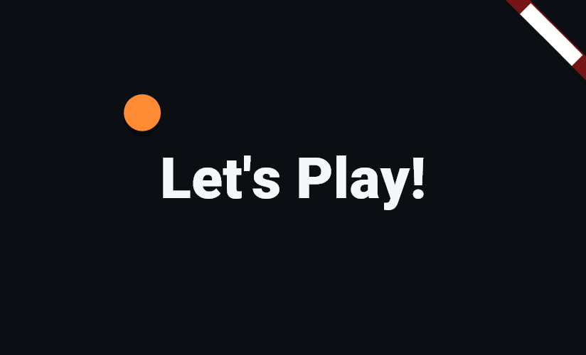
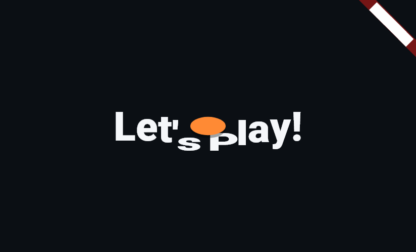
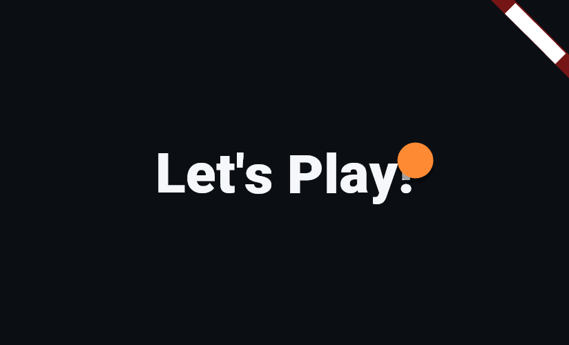

# Phase 4E: Choreographed Match-Start Transition

Upgrades Phase 4D's plain ball flyby into a full choreographed sequence:
a ball arcs in from the left, strikes a centered energetic phrase
("Let's Play!" / "Auf geht's!" / "C'est parti !"), dents it locally at
the point of contact, then continues bouncing off to the right while the
text springs back — all as one continuous, physically plausible motion.

**Status:** built and passing (150/150 tests — 142 pre-existing + 8 net
new after replacing Phase 4D's 4 ball-flyby tests with 12 covering the
new choreography).

---

## 1. Timing

Extended from Phase 4D's 450ms flyby-only duration to **900ms** total —
long enough for approach, impact, and recovery-while-departing to read
as a deliberate three-beat moment rather than a blink, but still
comfortably under a second and never long enough to feel like a loading
delay. The ball reaches the text (screen horizontal center) at exactly
the halfway point (450ms in) — coincidentally almost exactly where
Phase 4D's whole transition used to end, so the "extra" time is entirely
the impact/recovery/departure half, not a longer wait before anything
happens.

## 2. Localized cheer text

New ARB string `matchStartCheer`, centered on screen during the
transition:

- **English:** "Let's Play!"
- **German:** "Auf geht's!" (a natural, energetic "let's go!" used
  commonly in German sports contexts)
- **French:** "C'est parti !" (the standard energetic French "here we
  go!"/"let's go!")

**Confidence flag, matching the pattern from earlier phases**: this is
casual, energetic copy, not official table-tennis terminology, so there
was nothing to look up in a rules glossary the way "Gleichstand" or
"Paire" were verified. "Auf geht's!" and "C'est parti !" are both
common, natural idioms in their languages and read as correct to me, but
— exactly like other invented/non-rules phrasing flagged in prior
phases — I'd flag these two specifically for a native-speaker gut-check
before shipping, since energetic tone is more subjective than a rules
term with one correct answer.

Sized via a new `AppTypography.transitionHeadline` (40pt, w900,
`AppColors.scoreText`) — confident and legible at a glance without
approaching `scoreDisplay`'s dominance, since this is a brief flourish,
not the score.

## 3. Choreography

**`lib/widgets/match_start_transition.dart`** (new) replaces
`ball_flyby_indicator.dart` (deleted — fully superseded). A single
`AnimationController` (0..1 over 900ms) drives every part of the
sequence as pure functions of one shared `t`, pulled out as top-level
functions specifically so the choreography's timing could be asserted
directly in tests rather than only inferred from screenshots:

- `matchStartBallDx(t)` — constant horizontal velocity, off-left
  (`-1.3`) to off-right (`1.3`) alignment, linear in `t`. Real
  projectiles keep a constant horizontal speed while only the vertical
  path curves, so this is the physically-motivated choice, not just the
  simplest one.
- `matchStartBallDy(t)` — one big arc for the approach (`t <=
  impactT`), landing at exactly `y=0` (the text's vertical center) right
  at `impactT=0.5`; two decaying bounces for the departure (`t >
  impactT`), tapering toward 0 as the ball exits. Both halves evaluate
  to `0` exactly at `impactT`, so there's no visible seam or pop at the
  handoff.
- `matchStartImpactProximity(t)` — 0..1, peaking exactly at `impactT`
  and fading out within ~0.06 either side; drives a brief flatten/widen
  on the ball itself at contact, echoing the text's dent so the "hit"
  reads from both sides of the collision, not just the text.
- `matchStartTextEnvelope(t)` — 0 before impact (text stays completely
  undeformed while the ball is still approaching — the dent is a
  *reaction* to contact, not something anticipated), jumping to 1
  exactly at `impactT`, then decaying smoothly (`exp(-u*7)`) over the
  remaining ~450ms. Critically, this decay **overlaps** the ball's
  continued rightward bounce (§3d below) rather than waiting for it to
  finish — "text recovers" and "ball departs" are the same stretch of
  time, which is what makes the sequence read as one continuous gesture
  instead of three disconnected steps.
- `matchStartCharFalloff(charIndex, impactIndex)` — a Gaussian centered
  on the impact character index, spread ≈1.4 characters. Multiplied by
  the envelope above, this is what makes the dent *localized*: only the
  1-3 characters nearest the point of contact deform noticeably, and a
  character 4+ slots away is untouched.

**Why a segmented per-character `Transform`, not a `ShaderMask` or
custom `Path` clip** (per your implementation note): the text is split
into individual characters, each wrapped in its own small `Transform`
(`_DeformedChar`) that scales/translates based on `squash =
envelope(t) * falloff(index)`. This was the simplest of the three
options that still gives genuinely *localized* deformation (as opposed
to a `ShaderMask`, which would need a custom fragment shader to bend
glyph outlines, or a `Path`-based clip, which clips rather than
deforms). A handful of `Transform` widgets per frame is cheap — no
custom painting, no shader compilation, nothing that risks dropped
frames — and pivoting each character from `Alignment.bottomCenter`
gives the "pressed down into a surface" look the dent needs, rather than
shrinking in place.

**Single clean mount, no `AnimatedSwitcher`**: exactly one
`StatefulWidget` is mounted for the whole sequence, with one
`AnimationController` driving one `AnimatedBuilder` — the same rule
`CoinFlipIndicator` and `AnimatedScoreText` follow, avoiding the
double-mount pitfall from Phase 4B. `onComplete` fires once, from the
controller's status listener when it reaches `AnimationStatus.completed`
— the `AnimationController`-driven equivalent of
`TweenAnimationBuilder.onEnd`, explicitly allowed as an alternative to
`TweenAnimationBuilder` for exactly this reason (the choreography needed
several *concurrently* evaluated curves from one shared `t`, which reads
more clearly as one `AnimationController` + several pure functions than
as nested `TweenAnimationBuilder`s).

**`lib/screens/match_transition_screen.dart`**: unchanged in structure
from Phase 4D (still a `Scaffold` centering the transition widget, still
`pushReplacement`s to `destination` on completion, still never lingers
on the back stack) — only the child swapped from `BallFlybyIndicator` to
`MatchStartTransition(text: l10n.matchStartCheer, ...)`.

## 4. Screenshots

Three moments from the English sequence, captured as stills:

**Ball approaching:**


**Impact — the text dents locally where the ball strikes:**


**Ball continuing past, text recovering:**


The middle frame is the clearest evidence of §3's "localized, not
uniform" requirement: only "s" and "P" (nearest the ball) dip and
compress, while "Let'" and "lay!" stay essentially undeformed.

## 5. Tests

`test/team_clarity_and_transition_test.dart`'s ball-related group was
replaced with two new groups (Phase 4D's team-clarity tests earlier in
the same file are untouched):

**"match-start transition choreography math"** (6 tests) — unit tests
against the top-level pure functions directly, independent of pumping a
real widget through real frame durations:
- the ball is exactly centered at the impact instant;
- it travels from off-left to off-right over the full timeline;
- the text is completely undeformed before impact and jumps to full
  deformation exactly at impact;
- the deformation decays to near-zero by the end (it has sprung back
  before the ball is off-screen);
- the ball's own impact-squash peaks exactly at impact and fades within
  a small window either side;
- the per-character falloff is genuinely localized — a character 5
  slots from the impact index deforms less than 1%.

**"match-start transition"** (6 widget tests):
- the full phrase renders correctly across the per-character widgets in
  English (joining each character `Text`'s data back together and
  comparing to the source string);
- `onComplete` fires exactly once, at the end of the 900ms sequence;
- repeated partial pumps through the whole sequence never throw (the
  same double-mount guard used for the coin flip and Phase 4D's flyby);
- the localized cheer text is correct in German and French, checked by
  navigating through the real app in each locale and reading back the
  rendered characters — this is the direct answer to "add tests covering
  the new text content in all three languages";
- tapping "Start match" plays the transition then lands on the singles
  scoreboard, with the transition screen absent from the tree once
  settled and absent from the back stack after pressing back;
- tapping "Start match" in doubles lands on the 4-player scoreboard
  after the transition.

**A repeat of a known pitfall, caught immediately this time**: the new
localization test originally looped over German and French by calling
`tester.pumpWidget(const TableTennisScoreboardApp())` a second time
without a distinguishing key — which, per the exact lesson recorded in
PHASE4B_UI_POLISH.md's own screenshot-tooling notes, reuses the previous
iteration's `State` (and therefore its Navigator, still sitting on the
scoreboard screen from the first iteration) instead of creating a fresh
app. Fixed with `TableTennisScoreboardApp(key: ValueKey('app-${locale}'))`
per iteration, forcing a real remount each time.

## 6. Test results

```
flutter analyze → No issues found!
flutter test    → 00:15 +150: All tests passed!
```

150/150 (142 pre-existing + 8 net new: Phase 4D's 4 ball-flyby tests
were replaced by 12 covering the new choreography and localized text).
No regressions.

## 7. Scope confirmation

Only the match-start transition changed. No scoring logic, doubles
rotation, existing localization strings, or other screens were touched.
The one new localization string (`matchStartCheer`) is purely
decorative/energetic copy, flagged above for native-speaker confidence
per your request — not a claim of correctness the way rules terminology
fixes in earlier phases were.
