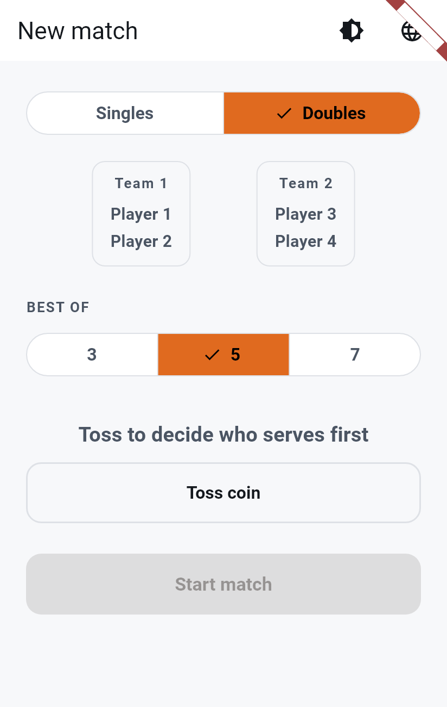
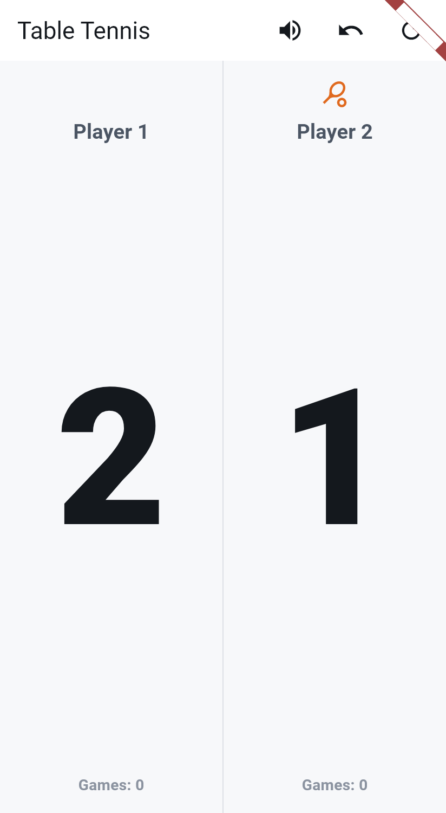
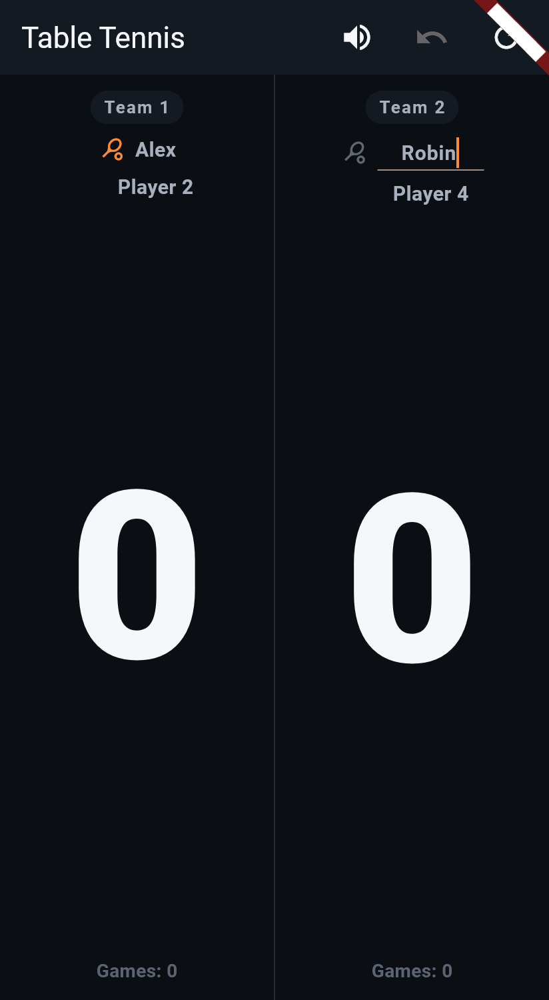

# Phase 4F: Light/Dark Theme, Editable Names, Receiver Icon, Transition Tweak

Four changes: a small timing tweak to Phase 4E's match-start transition,
a genuine Light/Dark/System theme choice (persisted across restarts,
dark still the default), tap-to-rename player/team names for the
current match, and a receiver icon that reuses the server icon's shape
instead of an unrelated arrow glyph.

**Status:** built and passing (188/188 tests — 150 pre-existing + 38 new).

---

## 1. Transition tweak: a longer beat on impact

`lib/widgets/match_start_transition.dart`: total duration extended from
Phase 4E's 900ms to **1100ms**, and the impact-squash window
(`matchStartImpactProximity`) widened from ±0.06 to ±0.08 of the
timeline. The complaint was specific — the impact/squash moment was
"still a touch too fast" — so rather than just stretching everything
uniformly, the extra time is weighted toward making that one moment
actually readable: the window it's visible in grew by about a third,
while the overall sequence only grew by ~22%. Still reads as snappy, not
slow.

## 2. Light/Dark/System theme

**The problem with just inverting colors**: a real light theme needs its
own contrast decisions, not the dark palette's values swapped. Notably,
the dark palette's accent orange (`#FF8A34`) reads as bright and vivid
against near-black but goes washed-out/pastel against a light
background — so the light palette uses a deeper, more saturated orange
(`#E06A1F`) specifically to keep the accent legible. This was checked
algorithmically, not just eyeballed — see the WCAG contrast tests below.

**`lib/theme/app_theme.dart`** — restructured around a `ThemeExtension`:
- `AppPalette` bundles every color role (`background`, `surface`,
  `accent`, `accentDim`, `scoreText`, `mutedText`, `faintText`,
  `divider`, `success`, `error`, `onAccent`) as one object.
  `AppPalette.dark` is the exact, unchanged Phase 4B palette;
  `AppPalette.light` is a new palette designed with the same role
  discipline (a near-white, not pure-white, background for the same
  "intentional, not a void" reasoning dark's near-black used; near-black
  score text mirroring `scoreText`'s "maximum contrast" role; muted/
  faint/divider tones re-derived for light-background contrast, not
  inverted from dark's values).
- `context.palette` (an extension on `BuildContext`) reads the active
  palette from `Theme.of(context)`. It falls back to `AppPalette.dark`
  if no `AppPalette` extension is present at all (a widget test wrapping
  a screen in a bare `MaterialApp` without an explicit `theme:` — the
  real app always goes through `buildAppTheme`), so this refactor didn't
  require touching the dozens of existing tests that construct their own
  minimal `MaterialApp`.
- `AppTypography`'s styles became methods taking `BuildContext`
  (`AppTypography.playerLabel(context)` instead of a plain constant) —
  a `const TextStyle` can't react to a theme switch, so every color had
  to move behind a context-aware lookup. Updated at all 12 call sites
  across the app.
- `buildAppTheme` now takes a `Brightness` and builds `ThemeData` from
  the matching palette, attached via `extensions: [palette]`.

**`lib/services/theme_preference.dart`** (new): persists the choice via
`shared_preferences` (new dependency). Best-effort, like
`VoiceAnnouncer` — any failure (including "no plugin implementation
available," which is what happens in a plain widget test that hasn't
called `SharedPreferences.setMockInitialValues`) is caught and treated
as "nothing saved yet," so persistence never blocks or crashes the app,
and no existing test needed to add mock setup just because this feature
exists.

**`lib/main.dart`**: loads the persisted mode on startup (defaulting to
dark until it resolves), exposes `themeMode`/`onThemeModeChanged` to
`SetupScreen`, and builds `theme`/`darkTheme` from `buildAppTheme` for
both brightnesses — `themeMode` (System/Light/Dark) then picks between
them exactly as `MaterialApp` already does natively.

**`lib/screens/setup_screen.dart`**: a new theme menu (`PopupMenuButton
<ThemeMode>`, reusing `ThemeMode.system/light/dark` directly rather than
inventing a parallel enum) sits next to the language menu in the app
bar, with a checkmark on the active choice — System/Light/Dark, all
localized (`themeMenuTooltip`, `themeSystemOption`, `themeLightOption`,
`themeDarkOption`; new ARB strings in en/de/fr).

**Screenshot** (light mode, English):

**Setup screen:**


**Scoreboard:**


## 3. Editable player/team names

**Scope decision**: "team names" here means the 4 individual on-court
player labels (Player 1-4) — not the "Team 1"/"Team 2" structural
headings from Phase 4C/4D. Renaming an individual doubles player is a
personal nickname; it doesn't answer "what do we call this pair," so
the team-level banner and voice wording are untouched by this feature
regardless of what the two teammates are named. This keeps doubles'
"Team 1"/"Team 2" consistency (the whole point of Phase 4C/4D) intact.

**`lib/models/player_names.dart`** (new): a small, pure-Dart,
never-persisted store of up to 4 custom names keyed 1-4 (matching the
`playerNLabel` numbering). `resolve(slot, default)` falls back to the
default label if nothing custom is set; `set(slot, name)` trims the
input and clears back to default if it's null, blank/whitespace-only,
or longer than `maxLength` (16) — a name that's too long is rejected
outright, not silently truncated, since a caller should already be
capping input length at entry (the `TextField`'s own `maxLength`); this
is a defensive backstop.

**`lib/widgets/editable_name_label.dart`** (new): tapping a name text
swaps it in place for a focused `TextField` pre-filled with the current
text (genuinely inline — not a dialog, not a separate screen).
Submitting (pressing done/enter) or tapping away (losing focus) commits
the trimmed result, or reverts to the default label if left blank. The
read-mode `Text` caps at one line with an ellipsis as a safety net
beyond the length cap itself.

**Where names can be edited**:
- **Setup screen** (`_TeamSlotPreview`, doubles only — singles has no
  pre-match name UI since there's nothing to preview before tossing):
  each of the 4 preview names is tap-to-rename, carried into
  `DoublesScoreboardScreen` via a new `initialNames` constructor param
  once the match starts.
- **Scoreboard** (both singles and doubles): every on-court name is
  tap-to-rename at any point during the match.

**Voice and banners** (singles only — see the scope decision above):
`announcementForPoint` (`lib/services/match_commentary.dart`) gained a
`nameFor` parameter that overrides the winner label entirely.
`ScoreboardScreen` passes a function that resolves a custom name if
set, falling back to **the voice layer's own language default**
(`VoiceAnnouncer.strings.playerLabel`) rather than the UI's
`AppLocalizations` — those two can legitimately differ (several
existing tests configure an explicit `VoiceAnnouncer` in one language
inside a UI showing another), and getting this wrong was the one real
regression caught while building this: an early version used the UI
locale as the fallback and broke the German/French voice-announcement
tests, which inject German/French `CommentaryStrings` into an English
UI tree on purpose. `DoublesScoreboardScreen` does **not** pass
`nameFor` at all — team-level wording stays exactly as Phase 4D left it.

**Reset behavior**: "New match" (both the button and the match-complete
dialog's) now also calls `PlayerNames.clear()`, so a fresh match starts
with every name back at its default, per your requirement.

**Localization**: one new string, `editNameHint` ("Tap to rename" /
"Zum Umbenennen tippen" / "Toucher pour renommer"), shown as the
tooltip/accessibility hint on every editable name.

**Screenshot** (name editing in action — Team 1's player renamed to
"Alex," Team 2's player mid-edit typing "Robin"):



## 4. Receiver icon: same shape, dimmed

**`lib/screens/doubles_scoreboard_screen.dart`**'s `_DoublesPlayerRow`:
the receiver icon changed from `Icons.call_received` (an unrelated gray
arrow) to the exact same `Icons.sports_tennis` glyph the server icon
uses, rendered at `context.palette.mutedText` with 55% opacity instead
of the server's solid `context.palette.accent`. Same symbol, visibly
lower "weight" — the pairing now reads as "who has it strongly vs.
who's about to get it" without a second icon to learn, per your
reasoning that no established "receiver" icon convention exists in this
app category. The tooltip text (`Rückschläger`/`Relanceur`/`Receiving`)
is completely unchanged — only the icon's visual treatment moved.

Visible in the name-editing screenshot above: Team 1's server icon
(solid orange) vs. Team 2's receiver icon (dimmed, same shape),
side by side.

## 5. Tests added

**`test/player_names_test.dart`** (9 tests): `PlayerNames`'s resolve/
set/clear behavior in isolation — default fallback, trimming, per-slot
independence, null/blank/too-long all reverting to default, exact-
max-length accepted, all 4 doubles slots independent.

**`test/theme_preference_test.dart`** (5 tests): default-to-dark with
nothing saved, save/load round-trip for all three `ThemeMode` values,
and a fresh instance seeing a previous instance's saved value
(simulating surviving a restart).

**`test/theme_and_names_test.dart`** (39 tests):
- **Palette rigor** (6 tests): light and dark are genuinely different
  colors; dark's colors are byte-for-byte unchanged from Phase 4B;
  light's background is measurably light and dark's is measurably dark
  (WCAG relative luminance); `scoreText` hits ≥7:1 contrast (WCAG AAA)
  against `background` in **both** palettes; `accent` hits ≥3:1 (WCAG
  AA large-content threshold) against `background` in both — this is
  the test that would have caught "just inverting the colors" landing
  on a washed-out accent; `buildAppTheme` attaches the right palette.
- **Theme menu** (4 tests): menu shows all 3 options with the correct
  checkmark; selecting Light actually changes the rendered
  `ThemeData.brightness` and `context.palette`; the choice survives a
  simulated cold restart (a fresh `TableTennisScoreboardApp` reading the
  same mocked storage); a fresh install with nothing persisted still
  defaults to dark.
- **Editable names, singles** (8 tests): tap reveals a pre-filled field;
  submitting renames and hides the field; clearing reverts to "Player
  1"; renaming one player doesn't touch the other; a custom name
  appears in the game-complete banner and is spoken by voice for a
  match win instead of "Player 1"; "New match" resets it; a
  maximum-length name doesn't overflow or throw.
- **Editable names, doubles** (3 tests): renaming one on-court slot
  only changes that slot; a renamed individual player never changes the
  "Team 1"/"Team 2" match-complete banner; a 16-character name in the
  compact doubles layout doesn't overflow or throw.
- **Setup screen doubles preview** (1 test): a name renamed there
  carries into the started match.
- **Receiver icon** (2 tests): the receiver icon is the same
  `Icons.sports_tennis` glyph as the server icon (not `call_received`),
  with a lower alpha; the German tooltip text is unchanged
  ("Rückschläger").

## 6. A real regression caught and fixed mid-build

Building the voice `nameFor` override initially fell back to the UI's
`AppLocalizations.of(context).player1Label` when no custom name was
set — which broke `localization_widget_test.dart`'s German/French voice
tests, which deliberately inject German/French `CommentaryStrings` into
an **English** UI tree to test the voice layer independent of the
on-screen locale (that's the whole point of those tests: voice and UI
language are architecturally independent in this app). The fix — fall
back to `VoiceAnnouncer.strings.playerLabel` instead of the UI's
localization — is described in §3 above, and is arguably a better
default than what the code would have had to fall back to anyway.

A second, unrelated testing gotcha (not a real bug, purely mechanical):
one new test looped over German and French by calling
`tester.pumpWidget(const TableTennisScoreboardApp())` a second time
without a distinguishing key inside the same test — the exact reused-
State pitfall already documented in PHASE4B_UI_POLISH.md and
PHASE4E_MATCH_START_TRANSITION.md. This one was avoided by keying each
loop iteration's app instance from the start, rather than being caught
after the fact.

## 7. Test results

```
flutter analyze → No issues found!
flutter test    → 00:17 +188: All tests passed!
```

188/188 (150 pre-existing + 38 new). No regressions.

## 8. Scope confirmation

Monetization, scoring logic, doubles rotation, and every other earlier
phase's behavior are untouched beyond what these four items required.
The `shared_preferences` package was added as a new dependency
specifically for theme persistence (its generated macOS plugin
registrant file is included in this commit, regenerated by the Flutter
tooling itself, not hand-edited).
