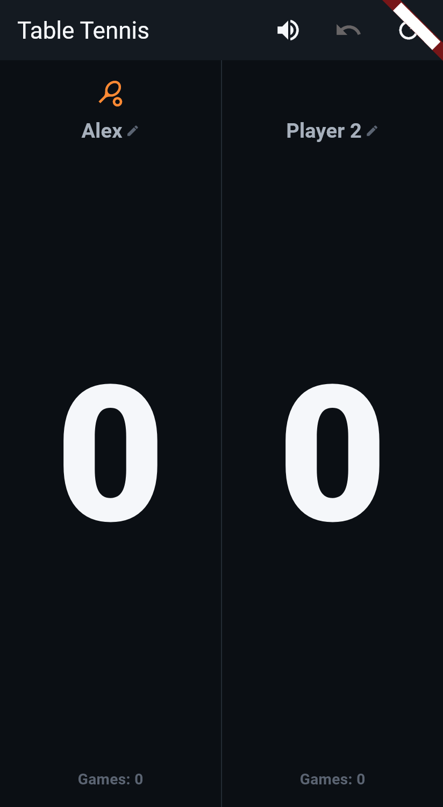
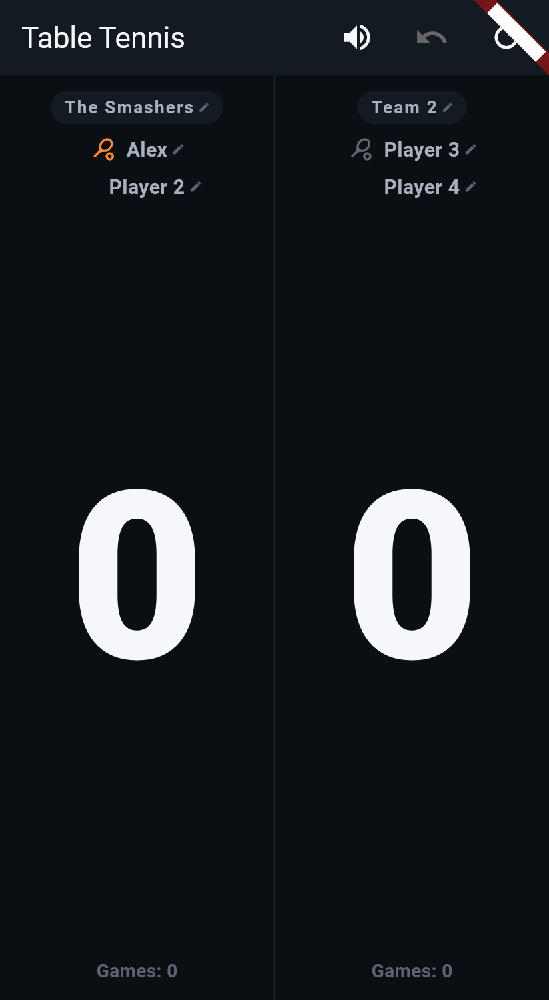
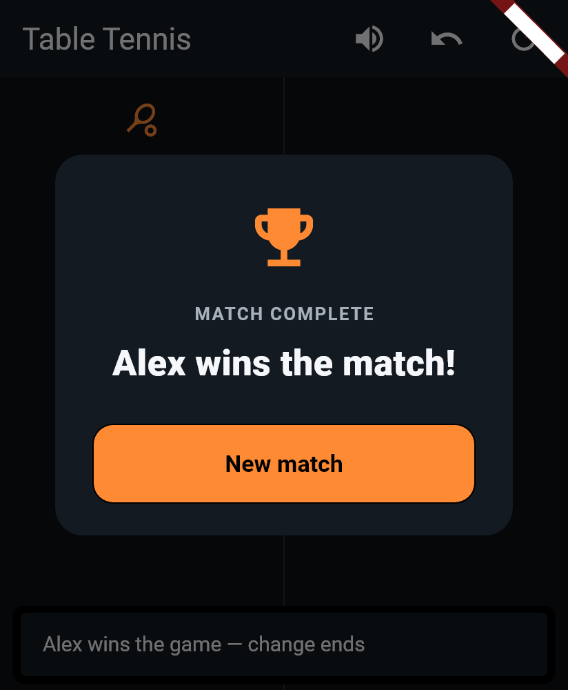

# Phase 4G: Name-Editing Discoverability, Team Names, Voice Sync, Dialog Redesign

Follows up on a real gap found in Phase 4F: name editing was functionally
wired but had zero visible affordance. This phase adds a visible edit
icon everywhere a name is tappable, adds an optional custom team name
(separate from the two individual player names), threads that team name
through voice/banners/setup-preview consistently, and redesigns the
match-complete dialog to match the app's established premium visual
language.

**Status:** built and passing (208/208 tests — 188 pre-existing + 20 new).

---

## 0. Honest status check (asked for before any changes)

Read the actual Phase 4F code before touching anything, rather than
assuming it worked as originally described:

- **Singles name editing**: functionally wired — `_PlayerZone` wraps
  each name in `EditableNameLabel`, and renaming correctly flowed into
  the banner and voice `nameFor` override.
- **Doubles name editing**: functionally wired — same widget, all 4
  on-court slots.
- **Discoverability**: genuinely missing. `EditableNameLabel`'s read
  mode was `InkWell(child: Tooltip(child: Text(...)))` — no icon, no
  underline, nothing visible. A `Tooltip` only appears on long-press or
  desktop hover, which is not a visible affordance at all. A user had no
  way to know a name could be tapped.
- **Optional team name**: not implemented at all — no field existed for
  a custom team name separate from the two player names.
- **Match-complete dialog**: unchanged, still a bare `AlertDialog`.

## 1. Visible edit affordance

**`lib/widgets/editable_name_label.dart`**: read mode now renders the
name text next to a small `Icons.edit` pencil, sized proportionally to
the name's own font (`fontSize * 0.68`) and colored `faintText` so it
reads as a quiet hint rather than competing with the name for attention.
This is the same widget used everywhere names appear, so the fix applies
uniformly: singles player zones, doubles player rows, doubles team
headings, and the setup screen's doubles preview all now show the icon.

## 2. Optional custom team name

**Scope, unchanged from the request**: this is an *additional* optional
field, not a replacement for the two individual player names, and it is
never auto-derived from them (e.g. concatenating "Alex" + "Sam" into
"Alex & Sam") — combining two names gets unwieldy the moment either is
renamed again, so a team name is its own explicit opt-in. Leaving it
unset keeps showing the generic "Team 1"/"Team 2" exactly as before.

**`lib/models/player_names.dart`**: gained a second, completely
independent store — `resolveTeam`/`isTeamCustom`/`setTeam` alongside the
existing `resolve`/`isCustom`/`set` for player names, both cleared
together by `clear()`. Setting a team name never touches either player
name and vice versa (tested explicitly — see §5).

**Where it's editable**: the doubles setup-screen preview's team heading
and the doubles scoreboard's team heading — both now `EditableNameLabel`
instead of plain `Text`, exactly mirroring how the 4 player names are
already editable in both places.

## 3. Voice/banner/heading sync

**`lib/screens/doubles_scoreboard_screen.dart`**: `_teamLabel(team)` —
already the single source used by the game-complete banner and the
match-complete dialog — now resolves through `_names.resolveTeam`
first, falling back to the localized "Team 1"/"Team 2" default. The team
heading above each side's two players now calls this same function,
so heading, banners, and dialog all agree by construction — there's only
one function deciding what a side is called.

**Voice**: `_scorePoint` now passes `nameFor: _voiceTeamNameFor` to
`_voice.announcePoint`, where `_voiceTeamNameFor` resolves a custom team
name if set, falling back to **the voice layer's own language default**
(`VoiceAnnouncer.strings.teamLabel`) rather than the UI's
`AppLocalizations` — exactly the same reasoning as
`ScoreboardScreen._voiceNameFor` from Phase 4F (those two label sources
can legitimately differ; several tests rely on that). This is the fix
for the specific class of bug you flagged: it would be easy to make the
banner and voice agree by accident (both reading a shared field) while
still having voice silently ignore a rename because it goes through a
different code path — a dedicated test asserts the *spoken* text
contains the custom name, not just the on-screen banner (see §5).

## 4. Match-complete dialog redesign

**`lib/widgets/match_complete_dialog.dart`** (new): replaces the bare
`AlertDialog` used by both `ScoreboardScreen` and
`DoublesScoreboardScreen`.
- A trophy icon (`Icons.emoji_events`, `accent` color) does a single
  scale-in flourish (0.4 → 1.0, `easeOutBack`, 380ms) — the same "one
  deliberate motion moment" philosophy as the score-pop animation in
  PHASE4B_UI_POLISH.md and the match-start transition in
  PHASE4E_MATCH_START_TRANSITION.md. Tasteful, not childish: no
  confetti, no bright multi-color flourish, just the one icon that
  reads as "sports broadcast," landing with a slight overshoot rather
  than popping in flatly.
- "MATCH COMPLETE" as a small muted eyebrow heading
  (`AppTypography.eyebrow`), consistent with how the setup screen labels
  its own sections.
- The winner announcement — still the exact same localized sentence
  (`l10n.matchCompleteMessage(...)`), so no wording changed — is now
  26pt/w800/centered instead of a default `AlertDialog` content's small
  muted body text. This is the "bigger/more confident typography"
  requirement: the winner announcement is now the dialog's visual focal
  point, not an afterthought under a title.
- "New match" is now a full-width `ElevatedButton` (previously a
  `TextButton`), matching the app's primary-action styling used
  elsewhere (e.g. "Start match"). Behavior is unchanged — same
  `Navigator.pop` + `_resetMatch()` — only the visual weight changed, as
  the redesign asked for a *look* consistent with the rest of the app
  without touching functionality.

Both `ScoreboardScreen` and `DoublesScoreboardScreen` now build this
same widget, so singles and doubles share one design rather than two
near-duplicate `AlertDialog` blocks.

## 5. Tests added

**`test/player_names_test.dart`** (+6 tests): `resolveTeam`/`setTeam`
behavior — default fallback, trimming, complete independence from
player names (setting one never touches the other, checked in both
directions), team 1/2 independence, blank/too-long validation, and
`clear()` reverting both stores.

**`test/names_sync_and_dialog_test.dart`** (new file, 14 tests):
- **Discoverability** (2 tests): every editable name in singles and
  every editable name in doubles (4 player names + 2 team headings)
  shows a visible `Icons.edit` icon, found via `find.descendant` scoped
  to each zone rather than relying on a specific icon key.
- **Team name** (9 tests): default stays "Team 1"/"Team 2" with nothing
  set; setting one updates the heading immediately without touching the
  other team; a custom team name doesn't affect either player's name and
  a renamed player doesn't affect the team name; a custom team name
  appears in the game-complete banner and the match-complete dialog
  message; **a custom team name is spoken by voice** for both a game win
  and a match win — this is the specific test you asked for, checking
  `tts.spoken.last` directly rather than only the visual banner, which
  is exactly the kind of check that would have caught the Phase 4D
  voice/banner desync bug if it had recurred here; renaming in the setup
  screen's doubles preview carries the team name into the started match;
  "New match" resets it back to the generic default.
- **Redesigned dialog** (3 tests): singles and doubles both render
  `MatchCompleteDialog` with the trophy icon key present and the message
  text's style at ≥24pt/w800; "New match" still closes the dialog and
  resets the board.

## 6. Screenshots

**Name editing, singles** (Player 2 shows the discoverable pencil icon;
Player 1 was just renamed to "Alex," also still showing its icon):



**Name editing, doubles** (Team 1 renamed to "The Smashers" with Alex as
one of its players; Team 2 left at its defaults for comparison — every
name, including both team headings, shows the pencil icon):



**Redesigned match-complete dialog** (winner "Alex" — the custom name
flowed through correctly; note the game-complete snackbar visible
underneath also says "Alex," confirming the sync holds across both
banner types):



## 7. Test results

```
flutter analyze → No issues found!
flutter test    → 00:30 +208: All tests passed!
```

208/208 (188 pre-existing + 20 new). No regressions — notably, the
dialog redesign didn't break any existing test, since every prior
assertion checked the winner sentence's exact text (e.g. `find.text('Team
1 wins the match!')`) or the `matchCompleteDialog`/`newMatchButton` keys,
never the underlying widget type, so keeping those keys and that exact
string was enough for full backward compatibility.

## 8. Scope confirmation

No scoring logic, doubles rotation, theme system, or other earlier
phase's behavior was touched beyond what these four items required. The
team-name feature reuses the existing `PlayerNames` instance and
`editNameHint` string — no new localization strings were needed.
