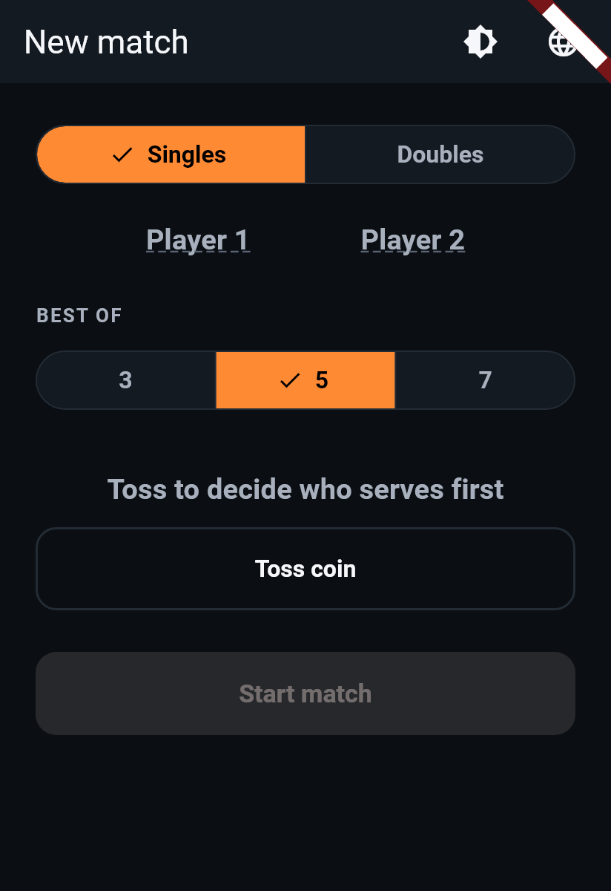
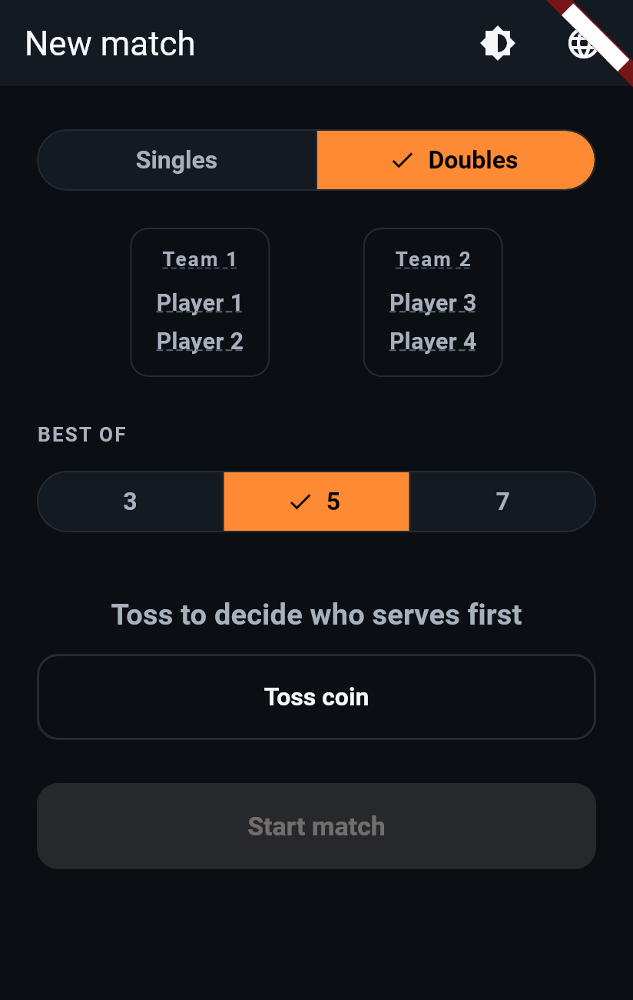
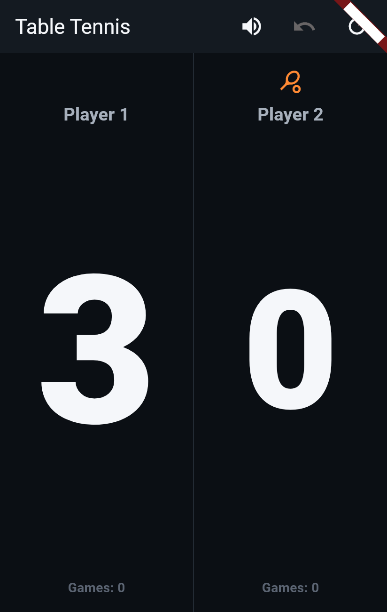

# Phase 4H: Name-Editing Refinement — Singles Parity, Locking, Underline Affordance

Three fixes to name editing, based on user testing of Phase 4G's
discoverable-icon version: give singles the same setup-screen editing
experience doubles already had, lock names once a match starts (editing
becomes setup-screen-only), and replace the pencil icon with a dashed
underline.

**Status:** built and passing (212/212 tests — 188 pre-existing + 20
rewritten/new, replacing 20 tests whose premise Phase 4H made obsolete).

---

## 1. Singles setup-screen name editing

Singles previously had **no** name-preview step at all before starting
— doubles got a 4-name preview in Phase 4F, singles got nothing. The
setup screen's mode-dependent preview area (already cross-faded via
`AnimatedSize` between "nothing"/"doubles preview") now shows a
`Player 1`/`Player 2` row for singles too, using the exact same
`EditableNameLabel` widget doubles already used. Renamed on setup,
carried into `ScoreboardScreen` via the existing `initialNames`
constructor param (previously only wired up for doubles).

## 2. Names locked once a match starts

**The change**: `EditableNameLabel` is now used *only* on the setup
screen. `ScoreboardScreen`'s `_PlayerZone` and
`DoublesScoreboardScreen`'s `_DoublesTeamZone`/`_DoublesPlayerRow` now
render names as plain `Text` — no `InkWell`, no `TextField`, nothing
happens on tap. A side effect worth calling out: since the name text is
no longer wrapped in its own `InkWell` absorbing the tap, tapping where
a name sits now falls through to the zone's own tap-to-score handler,
exactly like tapping anywhere else in that half — there's no dead zone,
and the in-match screen is, as requested, focused purely on score.

**A deliberate consequence: "New match" no longer clears names.** Phase
4F/4G's "New match" used to call `PlayerNames.clear()`. With editing
locked to setup, that behavior would silently and permanently discard a
name the user can no longer re-enter without leaving the scoreboard
entirely and re-doing setup from scratch — clearly worse than just
keeping it. `_resetMatch()` in both scoreboard screens now only resets
the engine; names persist across "New match" for the lifetime of that
scoreboard screen. This is called out explicitly since it inverts
Phase 4F's stated behavior, and several existing tests asserted the old
"resets to default" behavior — those were rewritten to assert the new,
considered behavior instead (see §4).

## 3. Dashed underline instead of a pencil icon

`EditableNameLabel`'s read mode now styles the name text with
`decoration: TextDecoration.underline` +
`decorationStyle: TextDecorationStyle.dashed` (in `faintText`), rather
than appending an `Icons.edit` glyph. This is a native Flutter text
decoration — no custom painting needed — and matches an established
convention (e.g. Google Contacts) for "this text is editable" without a
second symbol competing with the name. Since this widget is now
setup-screen-only (§2), the underline only ever appears there; the
scoreboard's plain `Text` has no decoration at all.

## 4. Tests

**`test/names_sync_and_dialog_test.dart`** was substantially rewritten
(the old version's "Optional custom team name" and "Name editing
discoverability" groups depended on tapping names directly on the
*scoreboard*, which Phase 4H's locking makes impossible):

- **Affordance** (4 tests): setup-screen singles and doubles previews
  (including both team headings) all carry the dashed-underline text
  decoration and show no `Icons.edit` anywhere; the singles and doubles
  *scoreboards* show no decoration on any name and confirmed that
  tapping one never opens a `TextField`.
- **Singles setup editing** (4 tests): the singles preview appears by
  default; tapping a name opens a pre-filled field; a name set on setup
  carries into the match and is then locked there; clearing a name on
  setup reverts it before the match even starts.
- **Names locked once a match starts** (9 tests): a name supplied via
  `initialNames` displays correctly and can't be edited from the
  scoreboard, in both singles and doubles; it reaches the game-complete
  banner and is spoken by voice for a match win; a maximum-length name
  renders without overflow in both modes; "New match" now *keeps* the
  custom name in both modes (replacing the old "resets it" assertions).
- **Optional custom team name** (10 tests, rebuilt around `initialNames`
  instead of live scoreboard taps): unset stays generic; setting one on
  the setup screen's own preview still works live; independence from
  player names; reaching the game/match banners; **spoken by voice**
  for both a game and a match win (the specific check you asked for,
  verifying the actual TTS text, not just the banner); carrying from
  setup into the match; and "New match" keeping a custom team name too.
- **Redesigned match-complete dialog** (3 tests, unchanged from Phase
  4G — none of them depended on scoreboard editing).

**`test/theme_and_names_test.dart`**: the two "Editable names: singles"
and "Editable names: doubles" groups (11 tests total) were removed
outright — their premise (editing on the scoreboard) no longer exists,
and their intent is now covered, more completely, by the new groups
above. The palette, theme-menu, setup-preview-carry-over, and
receiver-icon groups are untouched.

## 5. Screenshots

**Setup screen, singles** — the new preview step, with the dashed
underline visible under both names:



**Setup screen, doubles** — every name and both team headings show the
same underline, no icons:



**Scoreboard during play** — plain, undecorated names; the name area
was tapped immediately before this capture and, as expected, nothing
opened (it registered as an ordinary score tap instead, visible in
Player 1's score):



## 6. Test results

```
flutter analyze → No issues found!
flutter test    → 00:23 +212: All tests passed!
```

212/212 (188 pre-existing + 20 net new/rewritten, replacing the 20
tests whose scoreboard-editing premise Phase 4H removed). No
regressions.

## 7. Scope confirmation

No scoring logic, theme system, voice/banner wording, or receiver-icon
treatment changed beyond what these three items required. The optional
custom-team-name feature from Phase 4G is untouched in substance —
only *where* it can be edited (setup screen instead of the doubles
scoreboard) changed.
